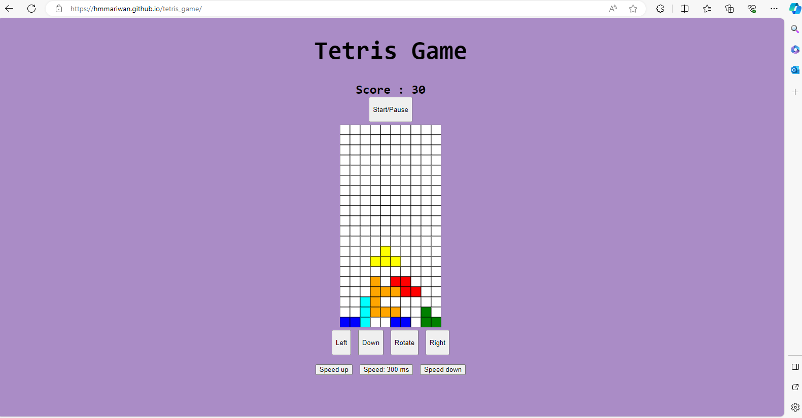
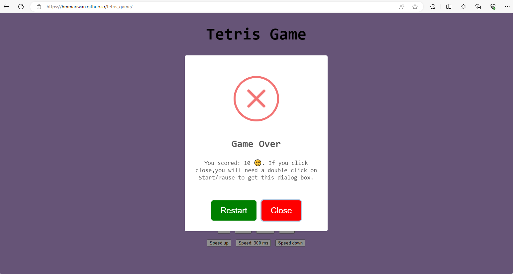
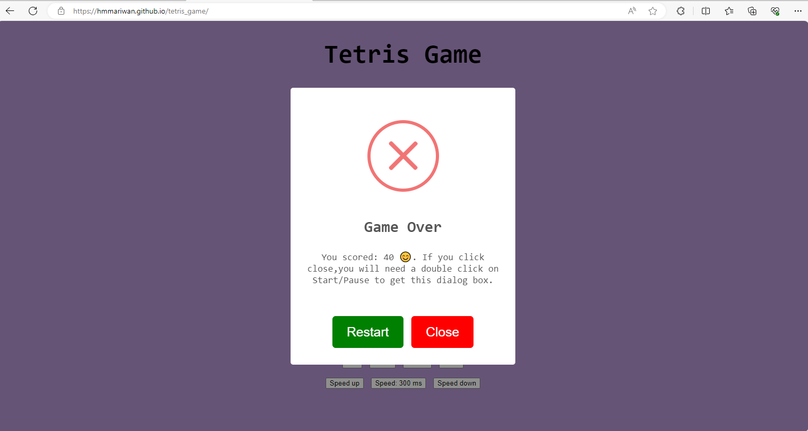
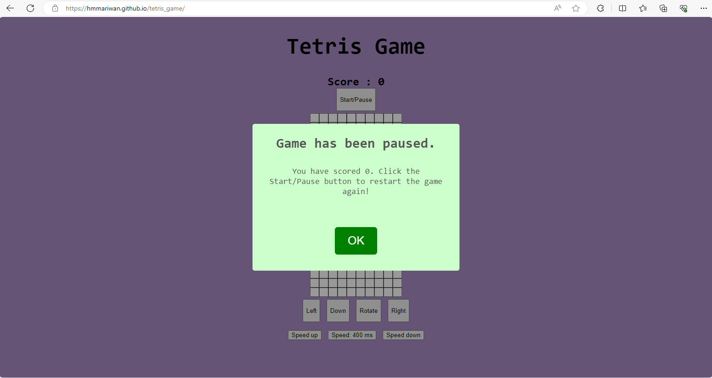
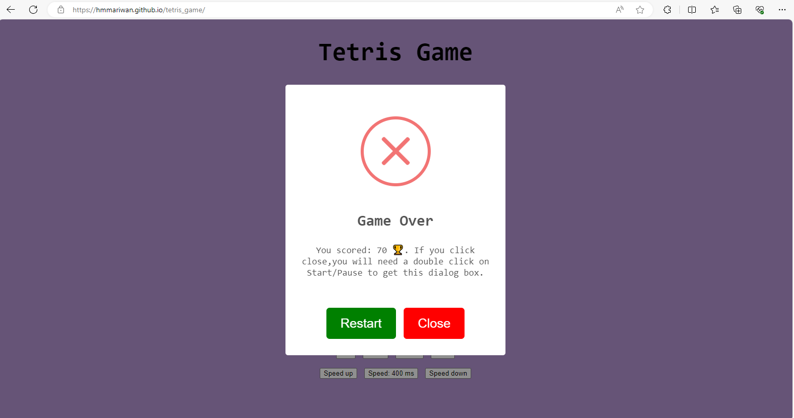

# Tetris Game

The user will be able to play a Tetris game on a laptop by using an arrow keys, and using the provided buttons on a small device. The player will be able to pause the game whenever they want it. The player will be informed about their scores whether the game is over or not.

## Testing

* I used the canvas element to draw and display the Tetris game grid and pieces.

* I used JavaScript to create some functions and methods to create a square, board, draw, reset the game & score and controls & speed of the game.

* I used a SweetAlert to display an alert box to the player about the game.

## Content  
* I used a W3Schools website to understand about the prototype property which allowed me to add new methods to a constructor function.

